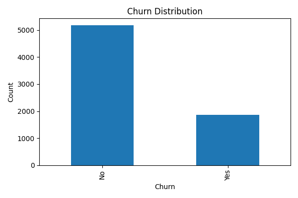
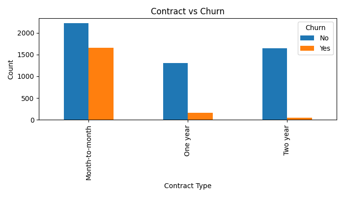
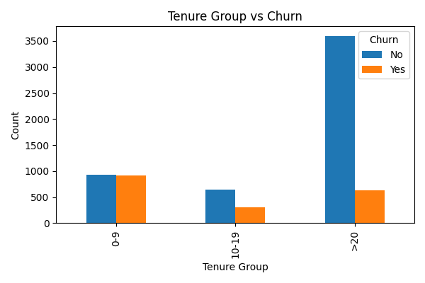

# 📊 Customer Churn Analysis

## 🔍 Overview
This project analyzes telecom customer churn data using **Excel, SQL, and Python** to identify key factors affecting customer retention.

---

## 🛠 Tools Used
- Excel (Pivot Tables & Charts)
- MySQL (Data Analysis Queries)
- Python (Pandas, Matplotlib)

---

## 📁 Project Structure
- `excel/` → Data analysis using pivot tables
- `sql/` → SQL queries for churn analysis
- `python/` → Python script for visualization
- `screenshots/` → Charts & graphs
- `data/` → Cleaned dataset

---

## 📊 Key Insights
- Month-to-month contract customers have highest churn
- Low tenure customers churn more
- Higher monthly charges → higher churn
- Gender has minimal impact

---

## 📈 Visualizations

### Churn Distribution


### Contract vs Churn


### Tenure vs Churn


---

## ▶️ How to Run (Python)
```bash
pip install pandas matplotlib
python python/churn_analysis.py
